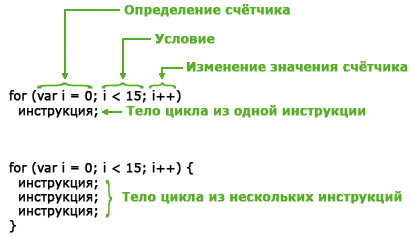
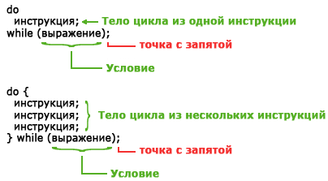
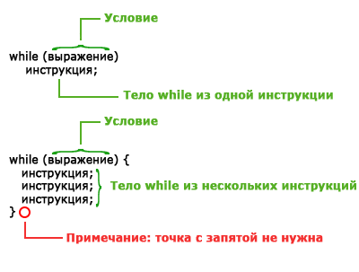

# Lesson_11-Cycles

> ### Для повторения однообразного действия можно использовоть _Циклы_

  
  
  Существует 3 вида операторов циклов
  
  

_**Словарь**_

[_Цикл_](https://ru.wikipedia.org/wiki/%D0%A6%D0%B8%D0%BA%D0%BB_(%D0%BF%D1%80%D0%BE%D0%B3%D1%80%D0%B0%D0%BC%D0%BC%D0%B8%D1%80%D0%BE%D0%B2%D0%B0%D0%BD%D0%B8%D0%B5))
— разновидность управляющей конструкции в [высокоуровневых языках программирования](https://ru.wikipedia.org/wiki/%D0%92%D1%8B%D1%81%D0%BE%D0%BA%D0%BE%D1%83%D1%80%D0%BE%D0%B2%D0%BD%D0%B5%D0%B2%D1%8B%D0%B9_%D1%8F%D0%B7%D1%8B%D0%BA_%D0%BF%D1%80%D0%BE%D0%B3%D1%80%D0%B0%D0%BC%D0%BC%D0%B8%D1%80%D0%BE%D0%B2%D0%B0%D0%BD%D0%B8%D1%8F).
